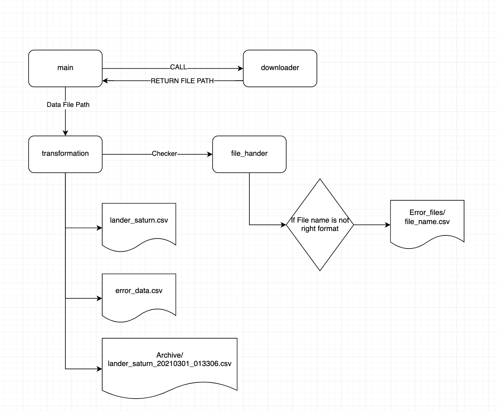

# sample - small file challenge

In the execution flow you would notice how the application is executing internally.
You would be able to find data transformation in `src/transformation.py`

- `split_id` - function would extract the mid value of UUID
- `transform_size` - would convert the size from an integer into a `magnitude`

**Prerequisite**

If you are not having python, please downmload from : <https://www.python.org/>

Setting up docker : <https://docs.docker.com/engine/install/>

Setting up virtual environment for python : <https://packaging.python.org/en/latest/guides/installing-using-pip-and-virtual-environments/>


## Table Contents
****
- [sample - small file challenge](#sample---small-file-challenge)
  - [Table Contents](#table-contents)
  - [Execution flow](#execution-flow)
  - [Environments](#environments)
    - [Local](#local)
    - [Docker](#docker)
  - [Technologies Used](#technologies-used)

****## Project Structure

```
/docs                      # document of the project
/sample/data                # dynamically created while downloading the file from GCS
/sample/error_files         # dynamically created when their is an error in the file or in data
/sample/final_data          # dynamically created output folder which contains `csv` per craft per planet
/sample/archive             # dynamically created after transforming the data 
/sample_data               # copied in sample data from (<https://github.com/sampleway/de-assignment>)
/src                       # contains the downloader from gcs, file handler and transformation logic             
/test                      # functionality for testing
    /unit                  # unit test folder
.gitignore            
README.md
Dockerfile                 # docker file for virtual setup
main.py                    # entry point for the whole project. Only contains initializer and function call
Makefile                   # simplify docker execution
config.ini                 # single point for setting up environment variables
requirements.txt           # libraries used within the project
setup_logger.py             # initializing a logger
```

## Execution flow



## Environments

You would be able to execute the whole program either Locally or via Docker. `Config.ini` should help you setup the local file path

### Local

While executing locally please update the `config.ini` file section `[LOCAL]` to the user specific location
Then execute the following

```text
pip3 install -r requirements.txt
python3 main.py
```

### Docker

You can use the Make file to call the required docker commands

- Building the docker image

```text
make build_docker_image
```

- Running the docker image

```text
make run_docker_image
```

- Copying the data folder out of docker container

```text
docker cp $(CONTAINER_NAME):/code/sample "/some/local/location"
```

## Technologies Used

- Python3
- Docker